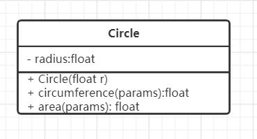
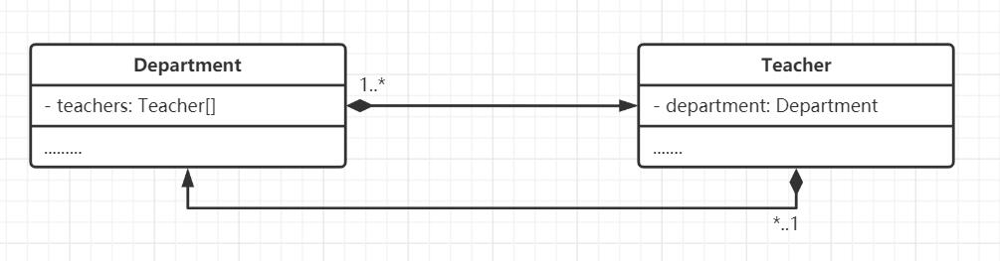

### 4-10. 设计一个用于人事管理的“人员”类。由于考虑到通用性，这里只抽象出所有类型人员都具有的属性：编号、性别、出生日期、身份证号等。其中“出生日期”声明为一个“日期”类内嵌子对象。用成员函数实现对人员信息的录入和显示。要求包括：构造函数和析构函数、复制构造函数、内联成员函数、带默认形参值的成员函数、类的组合。

```c++
#include <iostream>
#include <string>

using namespace std;

class Person {
public:
    enum Gender {
        Male, Female
    };

    class Date {
        int year, month, day;

    public:
        Date(int year = 2021, int month = 3, int day = 29) : year(year), month(month), day(day) {}
        Date(Date & date){
            this->year = date.year;
            this->month = date.month;
            this->day = date.day;
        }
        ~Date() {}

        int getYear() const {
            return year;
        }

        void setYear(int year) {
            Date::year = year;
        }

        int getMonth() const {
            return month;
        }

        void setMonth(int month) {
            Date::month = month;
        }

        int getDay() const {
            return day;
        }

        void setDay(int day) {
            Date::day = day;
        }

    };

private:
    int id;
    Gender gender;
    Date birthDate;
    string idCardNumber;

public:

    Person() {}
    Person(Person &p){
        this->id = p.id;
        this->gender = p.gender;
        this->birthDate = p.birthDate;
        this->idCardNumber = p.idCardNumber;
    }
    ~Person() {}

    int getId() const {
        return id;
    }

    void setId(int id) {
        Person::id = id;
    }

    Gender getGender() const {
        return gender;
    }

    void setGender(Gender gender) {
        Person::gender = gender;
    }

    const Date &getBirthDate() const {
        return birthDate;
    }

    void setBirthDate(const Date &birthDate) {
        Person::birthDate = birthDate;
    }

    const string &getIdCardNumber() const {
        return idCardNumber;
    }

    void setIdCardNumber(const string &idCardNumber) {
        Person::idCardNumber = idCardNumber;
    }


};
```

### 4-12. 定义一个DataType(数据类型)类，能处理包含字符型、整型、浮点型3种类型的数据，给出其构造函数。

```c++
class DataType
{
private:
    char ch;
    int integer;
    float floatNum;
public:
    DataType(char ch): ch(ch){}
    DataType(int integer): integer(integer){}
    DataType(float floatNum): floatNum(floatNum){}
    ~DataType();

    char getCh() const { return ch; }
    void setCh(char ch) { this->ch = ch; }

    int getInteger() const { return integer; }
    void setInteger(int integer) { this->integer = integer; }
    
    float getFloatNum() const { return floatNum; }
    void setFloatNum(float floatNum) { this->floatNum = floatNum; }

};
```


### 4-15. 根据例4-3中关于Circle类的定义的源代码绘出该类的UML图形表示。




### 4-17. 在一个大学的选课系统中，包括两个类：CourseSchedule类和Course类。其关系为：CourseSchedule类中的成员函数add和remove的参数是Course的对象，请通过UML方法显示的表示出这种依赖关系。


### 4-18. 在一个学校院系人员信息系统中，需要对院系（Department）和教室（Teacher）之间的关系以来部分建模，其关系描述为：每个Teacher可以属于零个或多个Department的成员，而每个Department至少包含一个Teacher作为成员。根据以上关系绘制出相应的UML类图。


